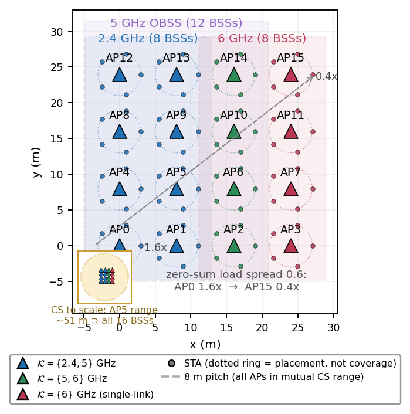
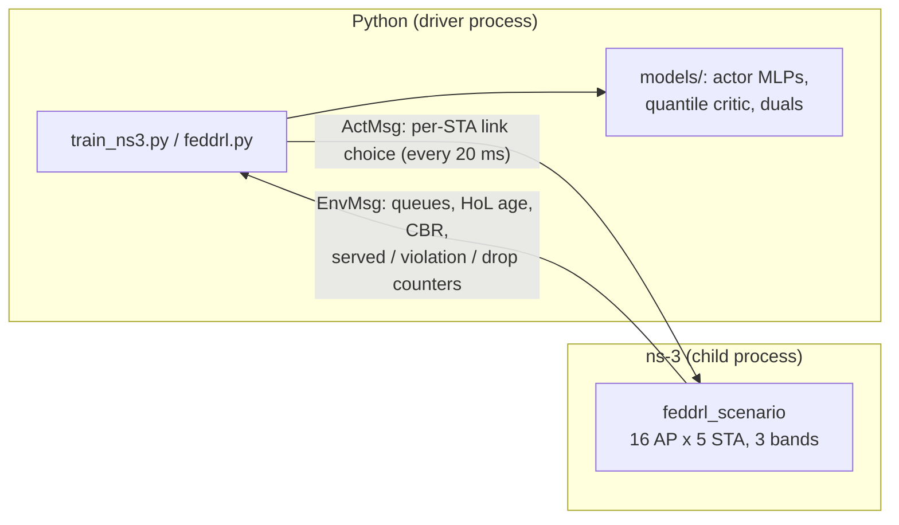
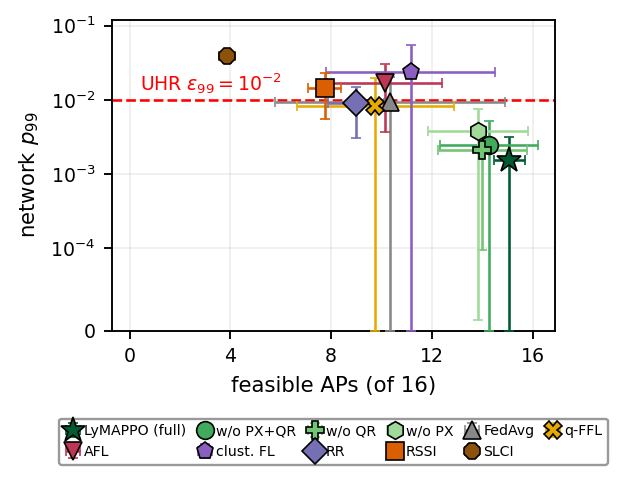
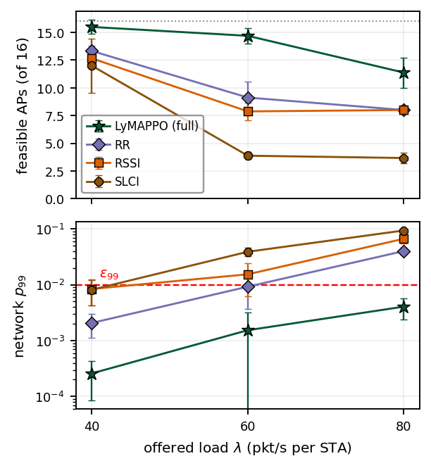

# LyMAPPO — ns-3-in-the-loop RL platform for Wi-Fi 8 (802.11bn) UHR experimentation

LyMAPPO is a reproducible simulation platform for studying **Ultra-High
Reliability (UHR)** — the per-BSS deadline-violation-rate targets of IEEE
802.11bn / Wi-Fi 8 — in **dense multi-band WLANs**, with reinforcement
learning agents trained *directly against ns-3* (full-stack 802.11
contention), not against an abstract surrogate.

It provides three things:

1. **An environment**: a 16-AP / 80-STA dense enterprise scenario on
   ns-3.40, with three bands (2.4/5/6 GHz), *asymmetric* per-AP link sets,
   shared-buffer multi-link operation (service-time routing),
   3-state Markov channels, and **survivor-bias-free accounting**
   (every packet is *decided* — delivered or aged out — and dropped
   packets count as violations). The learner interacts through a
   20 ms macro-slot shared-memory interface (ns3-ai `EnvMsg`/`ActMsg`).
2. **Agents and baselines** trained in the same loop, on equal terms:
   LyMAPPO (independent per-AP PPO + rate-form Lyapunov duals + price
   coupling + quantile critic), shared-actor MAPPO, independent
   PPO-Lagrangian, federated aggregation (FedAvg, q-FFL, AFL,
   clustered FL), and static policies (round-robin, RSSI-greedy, SLCI).
3. **A verification procedure**: scripted experiment batteries with
   pre-specified metrics, seed-level statistics (mean±std,
   Mann-Whitney, Holm correction), and documented crash/seed rules —
   so third parties can re-run and check the numbers, or plug in their
   own policy and compare.

<p align="center"></p>

## Fidelity scope (please read)

The PHY/MAC base is **802.11ax**; MLO is emulated with per-link
single-link devices (not native 802.11be MLO), and 802.11bn features
under standardization (MAPC: Co-SR / Co-TDMA) are **not** implemented —
the coordination field exists in the action interface but is frozen to
`none`. What is 11bn-oriented here is the *problem*: per-BSS
deadline-violation-rate constraints at density. Native 11be MLO and
draft-inspired MAPC prototypes are on the [roadmap](docs/ROADMAP.md).

## Quick start

The simulation always builds and runs on **Ubuntu Linux** — either
natively or inside **WSL2 on Windows**; native Windows builds of ns-3
are not supported. Pick your track below. See
[docs/INSTALL.md](docs/INSTALL.md) for details and troubleshooting.

### Track A — Ubuntu 22.04 / 24.04 (native Linux)

```bash
# 1. dependencies (once, interactive sudo)
sudo apt-get install -y build-essential cmake ninja-build git python3-dev \
    pybind11-dev libgtk-3-dev libxml2-dev libssl-dev libsqlite3-dev sqlite3 \
    libboost-dev libboost-program-options-dev libboost-system-dev \
    libboost-filesystem-dev libprotobuf-dev protobuf-compiler gcc-12 g++-12

# 2. ns-3.40 + this repo
git clone --depth 1 --branch ns-3.40 https://gitlab.com/nsnam/ns-3-dev.git ~/ns-3-dev
git clone https://github.com/yaki-toki/LyMAPPO.git && cd LyMAPPO
pip install -r requirements.txt

# 3. build (installs ns3-ai, syncs scenario+drivers, builds ns-3)
bash install.sh

# 4. smoke: one short training run (a few minutes)
bash scripts/smoke.sh
```

### Track B — Windows 10/11 (via WSL2)

One-time setup — install WSL2 with Ubuntu (administrator PowerShell,
then reboot):

```powershell
wsl --install -d Ubuntu-24.04
```

Open the Ubuntu shell (`wsl`) and follow **Track A inside the WSL
filesystem** (clone into `~`, not under `/mnt/c` or `/mnt/d`): the WSL
filesystem is much faster for the ns-3 build and a Linux checkout
guarantees LF line endings (`.gitattributes` enforces this either way).
`install.sh` automatically isolates the build from the inherited
Windows PATH, so a standard Windows development setup does not
interfere.

Two things work directly with **Windows Python** (no ns-3, no WSL
needed) — handy for developing policies and plotting on the host:

```powershell
git clone https://github.com/yaki-toki/LyMAPPO.git ; cd LyMAPPO
pip install -r requirements.txt
python -B -m pytest tests -q          # host-side unit tests (32 tests)
python -B scripts/figures/fig_topology.py   # figures from results/ CSVs
```

You can also drive WSL runs from PowerShell without opening a shell:

```powershell
wsl bash -c "cd ~/LyMAPPO && bash scripts/smoke.sh"
```

## Repository layout

| Path | Contents |
|---|---|
| `scenario/` | ns-3 scenario (C++): topology, channels, MLO queueing, KPI accounting, ns3-ai message interface |
| `drivers/` | `train_ns3.py` (training: LyMAPPO / MAPPO / PPO-Lagrangian / FL arms), `feddrl.py` (evaluation + static policies) |
| `models/` | `networks.py` (actor/critic, observation encoding), `mappo.py` (PPO/GAE, aggregators), `policy_api.py` (plug-in policy interface) |
| `examples/` | example plug-in policies (`policies/greedy_score.py`) |
| `scripts/` | experiment batteries (`_*.sh`) + `_core_cmp_analyze.py` (seed-level statistics) |
| `scripts/figures/` | figure generation from result CSVs |
| `sim/` | Python-side environment utilities shared with the drivers (link-set definitions, EDCA constants) and a fast standalone surrogate environment — **not** the evidence path of the paper (that is ns-3), kept for unit testing and quick iteration |
| `tests/` | unit tests (aggregation, FL baselines, observation encoding, surrogate environment) |
| `docs/` | INSTALL, REPRODUCE, TUTORIAL (custom policies), ROADMAP |

## Full workflow, step by step

### How a run works



The Python driver creates the ns3-ai shared-memory segment and launches
the ns-3 scenario as a child process (`ns3ai_utils.Experiment`). Every
20 ms macro-slot the scenario reports per-STA/per-link counters
(EnvMsg) and receives per-STA link selections (ActMsg). Training
updates PPO every 32-slot rollout and the Lyapunov duals every slot;
evaluation just runs the policy and prints `[KPI]` (network) and
`[KPI_AP]` (per-AP) lines **at the end of the episode** — a long silent
run is normal, do not kill it early.

All battery scripts follow the same pattern: sync `drivers/` +
`models/` into `$NS3_ROOT/contrib/ai/examples/feddrl/`, run from there,
append stdout to files under `$REPO_ROOT/results/`. Two environment
variables control every path (no absolute paths anywhere):

```bash
REPO_ROOT=<this checkout>    # auto-detected by the scripts
NS3_ROOT=$HOME/ns-3-dev      # override if ns-3 lives elsewhere
```

### Step 0 — install once

Follow the [Quick start](#quick-start) track for your OS. Under the
hood `install.sh` (idempotent, safe to re-run): clones ns3-ai into
`$NS3_ROOT/contrib/ai` and pip-installs its `ns3ai_utils` Python side;
replaces the ns3-ai examples index so **only** the `feddrl` scenario
builds (the bundled demos do not compile against pinned ns-3.40); syncs
`scenario/` + `drivers/` + `models/` into the example dir; configures
ns-3 (`default` profile — the `optimized` profile trips a GCC ICE on
ns-3.40) and builds with `-DNS3_AI_AVAILABLE`.

### Step 1 — smoke test (minutes)

```bash
bash scripts/smoke.sh
```

runs an 8-iteration training against the real scenario. Expected output,
one line per iteration:

```
[iter   6] T=32 aloss=-0.0041 closs=170.970 ret=+39.11 srv/slot=6.1 p99=0.0000 p99.9=0.0000 Z99=0.85±1.10 Z999=1.26±1.32 coord=0%
```

`T` = rollout slots, `aloss`/`closs` = actor/critic loss, `ret` = mean
shaped return, `srv/slot` = delivered packets per macro-slot per AP,
`p99`/`p99.9` = training-window violation rates, `Z99`/`Z999` = dual
mean±std across the 16 APs (these moving is the Lyapunov machinery
working), `coord` = coordination-mode usage (0 % — frozen to `none`).
It ends by writing `results/smoke_s0.pt`.

### Step 2 — train a policy (tens of minutes per seed)

```bash
cd $NS3_ROOT/contrib/ai/examples/feddrl
python3 train_ns3.py \
    --aggregation none --price-beta 0.05 --quantiles 8 --cvar-alpha 0.25 \
    --seed 0 \
    --arrival-pps 60 --iterations 100 --rollout 32 --macro-slot-ms 20 \
    --load-spread 0.6 --deadline99-ms 20 --deadline999-ms 40 \
    --link2-width 40 --eps99 1e-2 --eps999 1e-3 \
    --ckpt-out "$REPO_ROOT/results/lymappo_s0.pt" \
    --train-log-csv "$REPO_ROOT/results/lymappo_s0_train.csv"
```

Flag groups (see `--help` for everything):

| Group | Flags |
|---|---|
| Protocol (keep fixed to compare with the tables above) | `--arrival-pps 60 --macro-slot-ms 20 --load-spread 0.6 --deadline99-ms 20 --deadline999-ms 40 --link2-width 40 --eps99 1e-2 --eps999 1e-3` |
| Method — LyMAPPO full | `--aggregation none` (independent per-AP actors) + `--price-beta 0.05` (PX price coupling) + `--quantiles 8 --cvar-alpha 0.25` (QR tail critic) |
| Method — ablations | `--price-beta 0` (no PX), `--no-lyapunov` (no-Z), `--lyapunov-v`, `--z-clip` |
| Method — learned baselines | `--shared-actor` (MAPPO, one actor for all APs), `--cpo` (+`--cpo-kp/ki/kd`: independent PPO-Lagrangian) |
| Method — federated arms | `--aggregation uniform\|zq\|iw\|hybrid\|qffl\|afl\|cluster` |
| PPO knobs (paper defaults) | `--epochs 4 --gamma 0.99 --gae-lambda 0.95 --eps-clip 0.2 --lr-actor 3e-4 --lr-critic 1e-3` |
| Outputs | `--ckpt-out` (best checkpoint by per-AP CMDP infeasibility score), `--train-log-csv` (per-iteration metrics) |

### Step 3 — evaluate a policy

Evaluation loads a checkpoint (or plays a built-in static policy) on
**held-out channel seeds** and prints the KPI block at episode end:

```bash
cd $NS3_ROOT/contrib/ai/examples/feddrl
# trained checkpoint — protocol and Z-constants MUST match training
python3 feddrl.py --seed 10 --episode-ms 110000 --settle-ms 1000 \
    --arrival-pps 60 --macro-slot-ms 20 --load-spread 0.6 \
    --deadline99-ms 20 --deadline999-ms 40 --link2-width 40 \
    --z-clip 10 --eps99 1e-2 --eps999 1e-3 \
    --ckpt "$REPO_ROOT/results/lymappo_s0.pt" \
    --baseline-tag lymappo_s0_es10 >> "$REPO_ROOT/results/my_eval.log"
```

Static baselines, same protocol flags:

| Policy | Invocation |
|---|---|
| RSSI-greedy | `--policy rssi` |
| SLCI (least-congested interface) | `--policy slci` |
| Balanced round-robin | `--policy stub --balance-links` |

`--episode-ms 110000` is the main protocol (~45 min wall-clock each);
`11000` is the 10× shorter development protocol (~3 min; point
estimates agree within 0.4 feasible APs). `--seed` selects the
evaluation channel seed (the batteries use held-out seeds; seed 11 is
excluded — known ns-3.40 PHY assertion). Diagnostics: `--metric-log`
(per-slot vs. packet metric forms per AP), `--obs-dump` (per-slot
encoded observations for offline analysis).

### Step 4 — batteries, statistics, figures

The `scripts/_*.sh` batteries wrap Steps 2–3 for every arm of the study
(training matrix, seed extensions, ablations, federated arms, static
baselines, load sweep, sensitivity sweeps, long re-evaluation) — the
full list with what each produces is in
[docs/REPRODUCE.md](docs/REPRODUCE.md). Then:

```bash
python3 -B scripts/_core_cmp_analyze.py results/<dir>   # seed-level mean±std + Mann-Whitney
python3 -B scripts/figures/fig_results.py               # figures from results/ into figs/
```

The analyzers enforce the statistics conventions (seed as the
statistical unit, no pooled tests, mean±std reporting) described in
[docs/REPRODUCE.md](docs/REPRODUCE.md).

### Step 5 — full reproduction

Battery order for the complete study: `_final_matrix.sh` →
`_seed_ext.sh` → ablation/federation arms (`_ab_arms.sh`,
`_fairfl_arms.sh`, `_cluster_arm.sh`, `_noz_arm.sh`) → static baselines
(`_slci_evals.sh`) → `_longeval.sh`/`_longeval2.sh` (110 s re-eval) →
learned baselines (`_r3_baselines_full.sh`, `_r3_eval11s.sh`) →
`_load_sweep.sh`, `_beta_sweep.sh`, `_alphak_sweep.sh`. Budget
realistically: the full matrix is **multiple days** of wall-clock on a
single many-core machine (each 110 s evaluation episode alone is
~45 min); keep concurrent runs ≤ physical cores. Crash/seed exclusion
rules are documented in [docs/REPRODUCE.md](docs/REPRODUCE.md).

## Representative results

Approximate numbers from the settled operating point (λ = 60 pkt/s/STA,
deadlines 20/40 ms, 110 s evaluation episodes, held-out channel seeds;
mean ± std across seeds — reproduce with the batteries in
[docs/REPRODUCE.md](docs/REPRODUCE.md)):

| Policy | Feasible BSSs (of 16) ↑ | Network p99 ↓ | Network p99.9 ↓ | Delivered (of 4800 pkt/s) |
|---|---|---|---|---|
| **LyMAPPO (full)** | **15.1 ± 0.6** | **0.0017** | **0.0013** | 4794 |
| Round-robin | 9.0 ± 1.2 | 0.0103 | 0.0040 | 4783 |
| RSSI-greedy | 7.8 ± 0.7 | 0.0158 | 0.0068 | 4773 |
| SLCI (least-congested) | 3.9 ± 0.4 | 0.0423 | 0.0097 | 4754 |

Every arm delivers ≥ 99 % of offered traffic, so the differences above
are tail-shape differences, not capacity differences. The feasibility
and network-p99 margins over the static baselines are significant under
multiple-comparison (Holm) correction; the deeper p99.9 tails are
weaker (raw seed-level only vs. round-robin). Learned baselines trained
in the same loop land closer — LyMAPPO 14.6 ± 0.9 vs. PPO-Lagrangian
13.8 ± 1.5 vs. shared-actor MAPPO 12.4 ± 3.2 feasible BSSs (11 s
protocol) — a point-estimate lead that is within noise at n = 8 seeds.
Federated parameter aggregation (FedAvg, q-FFL, AFL, clustered FL)
stays *below* independent learning on held-out conditions (9.8–11.2
feasible BSSs), which is the platform's core cautionary finding.

<p align="center"></p>

<p align="center"></p>

## Develop your own policy

Implement `Policy.act(obs, link_masks) → PolicyAction` in your own module
and run it without touching any driver code — the evaluation driver loads
it by dotted path:

```bash
python3 feddrl.py ... --policy examples.policies.greedy_score.GreedyScorePolicy
```

Your policy receives, every 20 ms macro slot, the same observation bridge
as the LyMAPPO actor (per-AP CSI, backlog, HoL age, CBR, reconstructed
Lyapunov duals, allowed-link mask) and returns per-STA link choices plus a
MAPC mode. Output is validated every slot, so contract bugs fail fast. The
full walkthrough — interface, observation schema, running against the
built-in baselines, unit-testing without ns-3 — is in
[docs/TUTORIAL.md](docs/TUTORIAL.md); the API lives in
`models/policy_api.py` (numpy-only, no torch required) with a worked
example at `examples/policies/greedy_score.py`.

For a **trained** policy, `train_ns3.py` exposes the training loop —
observation encoding (106-D per AP), masked per-STA link logits, and reward
shaping — behind CLI switches; with a plug-in policy active, `--ckpt` is
handed to your constructor so you can load your own weights.

## Known issues

- ns-3 channel seed 11 triggers a pre-existing PHY assertion in
  ns-3.40 (`phy-entity.cc:509`); the batteries exclude and document it.
- ns3-ai is cloned from upstream master; if a future upstream change
  breaks the build, pin the version noted in `docs/INSTALL.md`.

## License

- `scenario/` (C++, links against ns-3): **GPL-2.0** — see `scenario/LICENSE`.
- Everything else (Python, scripts, docs): **MIT** — see `LICENSE`.

## Citation

If you use this platform, please cite the repository (see
`CITATION.cff`). The accompanying paper is under review; the citation
will be updated on publication.
